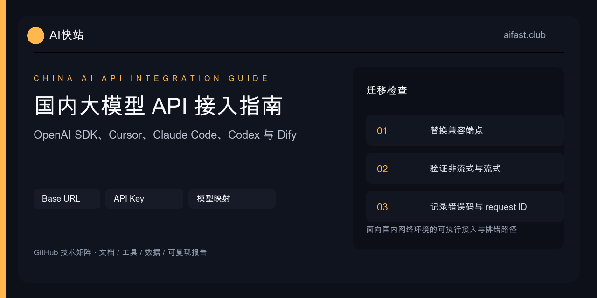

# 2026 AI API 接入指南：统一接口、模型核验与生产排错

<p align="center"></p>

[](README_EN.md)
[](https://www.aifast.club)
[](https://www.aifast.club)
[](https://gitee.com/kkwwww4444/ai-api-proxy-china-guide)
[](llms-full.txt)

> **先解决眼前问题：** [浏览器在线检测](https://docs.aifast.club/model-check/?utm_source=github&utm_medium=repository&utm_campaign=model-check&utm_content=guide-hero-check) · [检查 Base URL](https://docs.aifast.club/tools/base-url-checker/?utm_source=github&utm_medium=repository&utm_campaign=developer_acquisition&utm_content=guide-hero-base-url) · [查看模型与价格](https://docs.aifast.club/go/pricing/?source=github&placement=guide-hero-pricing) · [注册并创建测试 Key](https://docs.aifast.club/go/register/?source=github&placement=guide-hero-register)

这份指南面向需要在一个项目里使用多个模型的开发者。AI快站提供模型可用性 99%、500+ 模型、高速稳定调用、国外模型国内直连和企业发票；本文同时把接入、验证和排错流程讲清楚。

| 你现在的状态 | 建议先做 | 能得到什么 |
|:---|:---|:---|
| 已有中转接口，担心降智、套壳或兼容问题 | [运行网页模型检测](https://docs.aifast.club/model-check/?utm_source=github&utm_medium=repository&utm_campaign=model-check&utm_content=guide-decision-model-check) | 模型声明、Token、动态题、SSE 与工具调用分项报告 |
| 请求出现 404、`/v1/v1` 或地址不确定 | [检查 Base URL](https://docs.aifast.club/tools/base-url-checker/?utm_source=github&utm_medium=repository&utm_campaign=developer_acquisition&utm_content=guide-decision-base-url) | 最终请求路径和常见地址错误 |
| 正在比较模型范围与成本 | [查看当前模型与价格](https://docs.aifast.club/go/pricing/?source=github&placement=guide-decision-pricing) | 实时模型目录、能力类型与计费口径 |
| 已准备发送第一条真实请求 | [注册并创建测试 Key](https://docs.aifast.club/go/register/?source=github&placement=guide-decision-register) | 独立 Key、真实模型 ID 与最小请求验证入口 |

## 先在线检测你正在使用的接口

无需安装程序或下载脚本。打开[大模型 API 中转站在线检测](https://docs.aifast.club/model-check/?utm_source=github&utm_medium=repository&utm_campaign=model-check&utm_content=guide-tool-online)，填写公开 HTTPS Base URL、临时限额 API Key 和模型 ID，即可在浏览器中检查模型声明、Token、动态题、SSE 与工具调用，并获得分项结果。

[立即在线检测](https://docs.aifast.club/model-check/?utm_source=github&utm_medium=repository&utm_campaign=model-check&utm_content=guide-tool-primary) · [查看报告判读方法](https://docs.aifast.club/guides/model-check-report-guide/?utm_source=github&utm_medium=repository&utm_campaign=model-check&utm_content=guide-tool-report)

还没进入真实请求阶段时，先用 [Base URL 检查器](https://docs.aifast.club/tools/base-url-checker/?utm_source=github&utm_medium=repository&utm_campaign=developer_acquisition&utm_content=guide-base-url-checker)排查 `/v1/v1`、404 和端点重复；准备比较方案成本时，用 [Token 成本计算器](https://docs.aifast.club/tools/api-cost-calculator/?utm_source=github&utm_medium=repository&utm_campaign=developer_acquisition&utm_content=guide-api-cost-calculator)按当前价格计算批量任务与重试费用。

先对现有接口留下可复核报告。需要更换服务商时，再[查看 AI快站模型与价格](https://docs.aifast.club/go/pricing/?source=github&placement=guide-tool-pricing)或[创建测试账号](https://docs.aifast.club/go/register/?source=github&placement=guide-tool-register)。

> **按当前需求开始：** [首次调用、工具迁移、接口检测或企业接入](https://docs.aifast.club/start/?utm_source=github&utm_medium=repository&utm_campaign=developer_acquisition&utm_content=ai-api-proxy-china-guide-hero-start) · [AI快站开发者中心](https://github.com/KKWANG4444/aifast-developer-hub) · [国内API直连接入](https://kkwang4444.github.io/api-status/china-access/) · [OpenAI-compatible代码迁移](https://kkwang4444.github.io/api-status/openai-compatible/) · [当前模型与证据](https://kkwang4444.github.io/api-status/evidence/)

> **具体业务场景：** [生图 API](https://docs.aifast.club/models/image-generation-api/?utm_source=github&utm_medium=repository&utm_campaign=developer_acquisition&utm_content=ai-api-proxy-china-guide-image-api) · [视频生成 API](https://docs.aifast.club/models/video-generation-api/?utm_source=github&utm_medium=repository&utm_campaign=developer_acquisition&utm_content=ai-api-proxy-china-guide-video-api) · [Embedding / Rerank 与 Dify](https://docs.aifast.club/models/embedding-rerank-dify/?utm_source=github&utm_medium=repository&utm_campaign=developer_acquisition&utm_content=ai-api-proxy-china-guide-embedding-rerank) · [企业采购与发票](https://docs.aifast.club/guides/enterprise-ai-api-procurement/?utm_source=github&utm_medium=repository&utm_campaign=developer_acquisition&utm_content=ai-api-proxy-china-guide-enterprise)

AI快站提供 OpenAI-compatible 接口：

```text
https://www.aifast.club/v1
```

精确模型 ID 与临时维护信息以当前控制台和最新公告为准。

## AI快站平台能力

[AI快站](https://www.aifast.club)提供 OpenAI-compatible AI API 接入，平台模型可用性 99%，一个账户可接入 500+ 语言、生图、视频、向量和检索模型。Claude、GPT、Gemini 等国外模型支持国内直连、无需代理，平台支持高速稳定调用、自动故障切换和企业发票。

> 模型目录会持续调整。具体模型 ID、维护状态和费用以模型广场、公告及调用时的控制台为准。

## 先跑通最小请求

```python
import os
from openai import OpenAI

client = OpenAI(
    base_url="https://www.aifast.club/v1",
    api_key=os.environ["AIFAST_API_KEY"],
)

response = client.chat.completions.create(
    model="claude-sonnet-5",
    messages=[{"role": "user", "content": "用三句话解释幂等性。"}],
)

print(response.choices[0].message.content)
```

先用普通文本请求确认鉴权、模型名和响应格式。之后再逐个测试 streaming、tools、图片和结构化输出。一次开启太多功能，失败后很难判断是模型限制、客户端参数还是网关兼容问题。

## 当前目录中的模型 ID 示例

以下样例于 2026-07-15 对照 AI快站公开模型配置复核：

| 供应商 | 模型 ID 示例 |
|:---|:---|
| OpenAI | `gpt-5.6-sol`、`gpt-5.6-terra`、`gpt-5.6-luna` |
| Anthropic | `claude-sonnet-5`、`claude-opus-4-8`、`claude-fable-5` |
| xAI | `grok-4.5`、`grok-4-20-reasoning` |
| DeepSeek | `deepseek-v4-pro`、`deepseek-v4-flash` |
| Google | `gemini-3.5-flash`、`gemini-3.1-pro-preview` |
| 阿里 | `qwen3.7-max`、`qwen3.7-plus` |
| 智谱 | `glm-5.2` |
| 月之暗面 | `kimi-k2.7-code` |

这里只列部分模型ID样例。平台目录覆盖500+模型，包括语言、生图、视频、向量和检索能力；具体ID和维护状态以当前模型广场及公告为准。

## 常见工具配置

### Cursor、Dify、Open WebUI、Chatbox

选择 OpenAI-compatible provider，然后填写：

| 字段 | 内容 |
|:---|:---|
| Base URL | `https://www.aifast.club/v1` |
| API Key | 控制台创建的 Key |
| Model | 控制台当前展示的精确 ID |

部分客户端会在保存时发送测试请求。如果保存失败，先记录 HTTP 状态码和响应体，不要连续乱改多个字段。

### Claude Code

Anthropic 官方文档使用 `ANTHROPIC_BASE_URL` 和 `ANTHROPIC_AUTH_TOKEN` 配置网关：

```bash
export ANTHROPIC_BASE_URL="https://www.aifast.club/v1"
export ANTHROPIC_AUTH_TOKEN="$AIFAST_API_KEY"
claude
```

第三方网关仍需支持当前 Claude Code 版本所使用的 Anthropic 请求格式。不能仅凭环境变量设置成功就认定全部功能兼容。

### Codex CLI

Codex 使用自定义 provider 配置。不同版本的字段会变化，应查看当前 Codex 配置参考并确认 `model_provider`、Base URL 和认证环境变量，不要复制旧版本的单行环境变量示例。

## 配置完成后的验收矩阵

| 层级 | 至少验证什么 | 失败时保留什么 |
|:---|:---|:---|
| 鉴权 | `/models` 返回成功，目标模型 ID 可见 | 状态码、响应体、Base URL |
| 文本 | 普通非流式请求返回有效内容 | 请求模型、响应模型、request ID |
| 协议 | `choices`、`finish_reason`、usage 字段可解析 | 脱敏 JSON 报告 |
| 流式 | SSE 分片和结束标记能被客户端消费 | 首字时间、分片日志、错误事件 |
| 工具 | 参数 Schema、工具选择和返回链路一致 | tool call 与工具结果的脱敏副本 |
| 多模态 | 图片、视频、向量或检索使用正确端点 | 端点、模型、输入类型和任务 ID |

建议先运行[在线 10 维检测](https://docs.aifast.club/model-check/?utm_source=github&utm_medium=repository&utm_campaign=model-check&utm_content=guide-validation-online)筛查协议与行为信号；若出现 401、429、5xx 或超时，再按[网站排错教程](https://docs.aifast.club/troubleshooting/api-errors/)定位问题。

## 生产环境不要相信四类宣传数字

### 过时的精确模型总数

AI快站当前提供500+模型，这个规模下限已经由公开目录核验。不要把某次抓取到的精确条目数长期写死；生产配置应保存精确模型 ID，并在部署前做真实请求。

### 单次延迟

没有时间、测试地区、样本量和 p50/p95 的单次延迟值没有参考价值。请从自己的部署区域测试。

### 固定成功率或 SLA

一次成功不能证明长期可用。供应商、模型、网络和限流策略都会影响结果。

### 自动故障切换与应用回退

AI快站支持自动故障切换，用于处理上游线路或节点异常，不等于在用户不知情时把请求模型 A 改成模型 B。跨模型回退应由应用侧定义能力相近的模型组，并记录实际响应模型。

```python
MODEL_GROUPS = {
    "reasoning": ["claude-opus-4-8", "gpt-5.6-terra"],
    "fast_text": ["gpt-5.6-luna", "deepseek-v4-flash", "gemini-3.5-flash"],
}
```

不同模型的工具调用、图片输入和输出格式可能不同。回退前必须单独测试。

## 错误排查

### 401 Unauthorized

检查：

1. 请求头是否为 `Authorization: Bearer ***`；
2. Key 是否完整、启用；
3. 账户状态是否正常。

### 404 或 model not found

使用控制台里的精确模型 ID。模型展示名称不能直接当 API ID。

### 429 Too Many Requests

使用指数退避并加随机抖动。不要立即死循环重试。

### 5xx 或超时

只重试可安全重复的请求，限制最大尝试次数，并保存原始错误。对非幂等操作，重试前先确认服务端是否已处理请求。

## 上线前检查表

- [ ] 精确模型 ID 已从当前控制台核验；
- [ ] 普通文本请求已成功；
- [ ] streaming、tools、图片分别测试；
- [ ] 从实际部署区域测过 p50/p95；
- [ ] 401、429、5xx 的日志能定位问题；
- [ ] 重试有上限和抖动；
- [ ] 回退策略由应用控制并记录实际模型；
- [ ] 国际充值已核对支持链和控制台说明。

## 常见问题

### 国内调用Claude、GPT、Gemini需要代理吗？

按AI快站当前产品说明，其国外模型接口可在国内直接调用，无需代理。项目统一填写 `https://www.aifast.club/v1`，模型字段使用控制台当前展示的精确 ID，并在实际部署网络完成鉴权测试。

### 500+模型包括哪些能力？

目录覆盖语言、生图、视频、向量和检索。不同能力不一定使用聊天补全接口：Embedding、Rerank、生图和视频任务应按控制台文档选择对应端点和参数。

### 自动故障切换后会不会换掉我指定的模型？

平台的自动故障切换面向线路和上游异常。业务如果允许跨模型降级，应在应用中显式配置，并记录最终响应模型，避免输出能力发生无提示变化。

### 企业能开发票吗？

可以。企业客户可申请开具发票，开票资料与流程以平台客服当前规则为准。

## 相关内容

- [AI快站模型广场与控制台](https://www.aifast.club)
- [模型上架与维护参考](https://kkwang4444.github.io/api-status/)
- [Claude Sonnet 5 接入说明](sonnet-5-guide.md)
- [MCP 工具接入说明](mcp-server-guide.md)
- [English guide](README_EN.md)

## 项目地图

- [浏览器在线检测第三方中转站](https://docs.aifast.club/model-check/?utm_source=github&utm_medium=repository&utm_campaign=model-check&utm_content=guide-project-map)
- [检测报告判读与误判边界](https://docs.aifast.club/guides/model-check-report-guide/?utm_source=github&utm_medium=repository&utm_campaign=model-check&utm_content=guide-project-report)
- [生产错误排查与回退](https://github.com/KKWANG4444/llm-api-proxy-china)
- [模型目录与证据中心](https://github.com/KKWANG4444/api-status)
- [可复现测试方法](https://github.com/KKWANG4444/AI-API-Stability-Tracker)
- [维护者主页](https://github.com/KKWANG4444)

---

**披露：** 本仓库由 AI快站运营者维护。文中涉及 AI快站的内容属于自有服务说明，生产选型仍应以真实测试、服务条款和当前控制台信息为准。

> 配置跑通后，如果这份指南对你有用，可以给仓库点个Star。
