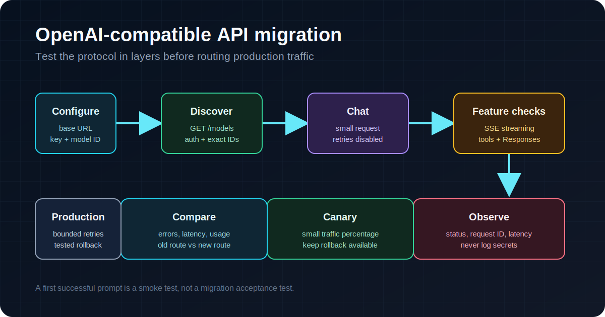

# Migrating to an OpenAI-compatible API without breaking production

Changing an OpenAI integration often looks like a two-line job:

```python
client = OpenAI(
    api_key=os.environ["OPENAI_API_KEY"],
    base_url=os.environ["OPENAI_BASE_URL"],
)
```

That is enough for a smoke test. It is not enough for production.

I have seen migrations pass a simple chat request and then fail on model discovery, streaming, tool calls, retries, or a client that quietly appends the wrong path. The phrase "OpenAI-compatible" describes a protocol family, not a guarantee that every endpoint and feature behaves identically.

This guide uses the official OpenAI Python SDK and ordinary `curl` commands. The checks work with a self-hosted gateway, a local model server, or a managed API gateway.



## Start with the wire, not your framework

Do not begin the migration inside an agent framework. Test the HTTP boundary first. Frameworks add their own model aliases, retries, fallbacks, and error wrapping, which makes a basic URL mistake much harder to see.

Set three environment variables:

```bash
export OPENAI_BASE_URL="https://www.aifast.club/v1"
export OPENAI_API_KEY="replace-with-your-key"
export OPENAI_MODEL="copy-an-exact-model-id-from-your-provider"
```

Keep the model ID outside the code. Model catalogs change, and copying an ID from an old tutorial is a reliable way to get a 404.

First, check model discovery:

```bash
curl -sS "$OPENAI_BASE_URL/models" \
  -H "Authorization: Bearer $OPENAI_API_KEY" \
  -H "Accept: application/json"
```

A successful response proves four small but useful things: DNS works, TLS works, the base path is plausible, and the credential reaches an authenticated endpoint. It does not prove that chat, streaming, tools, or images work.

Now send the smallest useful chat request:

```bash
curl -sS "$OPENAI_BASE_URL/chat/completions" \
  -H "Authorization: Bearer $OPENAI_API_KEY" \
  -H "Content-Type: application/json" \
  -d "{
    \"model\": \"$OPENAI_MODEL\",
    \"messages\": [{\"role\": \"user\", \"content\": \"Reply with OK\"}],
    \"temperature\": 0
  }"
```

Use the exact catalog ID returned by your provider. A brand name such as "Claude" or "Gemini" is not an API model ID.

## The `/v1` trap

Most migration failures I see are path construction mistakes.

The official Python SDK accepts a `base_url`. If the value already ends in `/v1`, your request becomes:

```text
https://gateway.example/v1/chat/completions
```

That is usually correct. Problems start when a wrapper adds another version segment:

```text
https://gateway.example/v1/v1/chat/completions
```

The opposite mistake also happens: a client expects the version in `base_url`, receives only `https://gateway.example`, and calls `/chat/completions` without `/v1`.

Before blaming the credential, log the final request URL. In Python, an `httpx` event hook is a clean way to do it without printing the key:

```python
import httpx
from openai import OpenAI


def log_request(request: httpx.Request) -> None:
    print(f"-> {request.method} {request.url}")


http_client = httpx.Client(
    event_hooks={"request": [log_request]},
    timeout=httpx.Timeout(60.0, connect=5.0),
)

client = OpenAI(
    api_key="replace-with-your-key",
    base_url="https://www.aifast.club/v1",
    http_client=http_client,
    max_retries=0,
)

models = client.models.list()
print(models.data[0].id if models.data else "No models returned")
```

I disable retries during diagnosis. One request should produce one observable result. Once the integration is correct, retries can go back on.

## A 401 is not a connectivity failure

These status codes point to different layers:

- `401`: the server did not accept the credential. Check the header format, whitespace, key scope, and whether the application loaded the environment variable you expected.
- `403`: the credential may be valid but lacks permission, or a security layer blocked the request.
- `404`: check the final URL, endpoint family, and exact model ID. Some gateways return 404 for an unsupported endpoint.
- `429`: you may have hit a request or token limit, exhausted quota, or reached upstream capacity. Inspect the response body and headers before retrying.
- `5xx`: the gateway or an upstream service failed. Retry only if the operation is safe to repeat.

Do not turn every failure into a retry. Retrying a malformed request or bad key only creates noise.

The current OpenAI Python SDK retries connection errors, 408, 409, 429, and server errors by default. Its default maximum retry count is two. If your application also wraps the SDK in a tenacity loop, a single logical operation can produce far more requests than you intended.

Use explicit settings:

```python
import os
from openai import OpenAI

client = OpenAI(
    api_key=os.environ["OPENAI_API_KEY"],
    base_url=os.environ["OPENAI_BASE_URL"],
    timeout=60.0,
    max_retries=2,
)
```

The SDK's default overall timeout is long, currently ten minutes, with a five-second connection timeout in its generated constants. That may be reasonable for long generations, but it can be painful for a synchronous web request. Choose a timeout for your own workload instead of inheriting it accidentally.

## Test streaming separately

A non-streaming response can succeed while streaming fails through a proxy, CDN, ingress controller, or application server. Buffering is the usual culprit.

Test the raw event stream:

```bash
curl -N "$OPENAI_BASE_URL/chat/completions" \
  -H "Authorization: Bearer $OPENAI_API_KEY" \
  -H "Content-Type: application/json" \
  -d "{
    \"model\": \"$OPENAI_MODEL\",
    \"messages\": [{\"role\": \"user\", \"content\": \"Count from 1 to 5 slowly\"}],
    \"stream\": true
  }"
```

`curl -N` disables its output buffering. You should see incremental `data:` events rather than one large response at the end.

If the SDK streams correctly on your laptop but the browser receives everything at once, inspect every hop between the application and the client. Reverse proxies may buffer responses, serverless platforms may impose execution limits, and your own web framework may consume the iterator before returning it.

## Chat Completions and Responses are not interchangeable

A gateway can support `/v1/chat/completions` and still reject `/v1/responses`. The request bodies differ too: Chat Completions uses `messages`, while Responses commonly uses `input` and has a different event model.

Check the endpoint your client actually uses. A tool that says "OpenAI-compatible" may have migrated to Responses while your gateway only implements Chat Completions. A 404 in that situation is a protocol mismatch, not proof that the whole gateway is down.

Keep the first migration test on Chat Completions unless your application specifically requires Responses. Then add a separate acceptance test for Responses instead of assuming support.

## Tool calls need their own acceptance test

Text output says nothing about tool-call compatibility. Test a tiny function with a strict schema:

```python
import json
import os
from openai import OpenAI

client = OpenAI(
    api_key=os.environ["OPENAI_API_KEY"],
    base_url=os.environ["OPENAI_BASE_URL"],
    timeout=60.0,
    max_retries=0,
)

response = client.chat.completions.create(
    model=os.environ["OPENAI_MODEL"],
    messages=[
        {"role": "user", "content": "What is the weather in Tokyo? Use the tool."}
    ],
    tools=[
        {
            "type": "function",
            "function": {
                "name": "get_weather",
                "description": "Return weather for one city",
                "parameters": {
                    "type": "object",
                    "properties": {
                        "city": {"type": "string"}
                    },
                    "required": ["city"],
                    "additionalProperties": False,
                },
            },
        }
    ],
)

message = response.choices[0].message
print(json.dumps(message.model_dump(), indent=2, ensure_ascii=False))
```

Verify the function name, JSON arguments, finish reason, and behavior while streaming. Some adapters flatten tool calls into text or emit arguments in partial chunks that your parser does not expect.

## Preserve the evidence you will need later

During rollout, log:

- the final request path, without secrets;
- HTTP status and provider error type;
- the response `model` field;
- request IDs from response headers or official SDK properties;
- latency and retry count;
- whether the request streamed;
- the selected route or upstream, if the gateway exposes it.

Never log API keys, full authorization headers, or user prompts containing private data.

Request IDs matter when a provider investigates a failure. Read them from the response. Do not invent an ID on the client and present it as the provider's request ID.

## A rollout sequence that catches real failures

I use this order:

1. Call `/models` with `curl`.
2. Send one non-streaming Chat Completions request.
3. Repeat it with the official SDK and retries disabled.
4. Test SSE streaming with `curl -N`.
5. Test tool calls if the application uses them.
6. Test Responses only if the client needs that endpoint.
7. Restore deliberate timeout and retry settings.
8. Send a small percentage of production traffic to the new route.
9. Compare status codes, latency, token usage, and output handling.
10. Keep the old route available until the observation window is clean.

A free online gateway check can help with the early protocol checks: [inspect an endpoint and read the report](https://docs.aifast.club/model-check/?utm_source=devto&utm_medium=article&utm_campaign=model-check&utm_content=migration-guide-model-check). Treat black-box results as compatibility signals, not proof of the underlying model's identity.

For a managed OpenAI-compatible endpoint, AIFast publishes its base URL as `https://www.aifast.club/v1`. The operator states that its catalog covers 500+ models and that supported model IDs and maintenance status are listed in the live console. I maintain this guide as part of the AIFast team, so verify the service with your own acceptance requests rather than treating this article as independent validation.

## What a successful migration means

A successful migration is not "the first prompt returned text." It means every feature your application depends on has an explicit test, failures are observable, retries are bounded, and rollback is still possible.

The two-line configuration change is real. The rest of the work is proving that those two lines did not hide a protocol mismatch.
